# MCT-Lernpfad Viewer

Kleiner lokaler Viewer für den MCT-Lernpfad.

## Start

Im Verzeichnis:

```bash
python3 -m http.server 8765 --bind 127.0.0.1
```

Dann in Chromium:

```text
http://127.0.0.1:8765/
```

Oder als eigenes App-Fenster:

```bash
chromium --app=http://127.0.0.1:8765/
```

Standardmäßig wird `mct-lernpfad.md` geladen.

Ein anderes Markdown-Dokument:

```text
http://127.0.0.1:8765/?doc=demo-interaktiv.md
```

## Interaktives SVG einbetten

Nicht:

```markdown

```

sondern:

```html
<object
  data="diagrams/git-commit-snapshot-diff.svg"
  type="image/svg+xml"
  width="100%"
  height="720">
</object>
```

Das SVG wird dadurch als eigenes Dokument geladen und sein JavaScript läuft.

## Absichtliche Einschränkung

Der Viewer rendert Raw HTML absichtlich unverändert, damit `<object>` möglich ist.
Deshalb nur vertrauenswürdige Markdown-Dateien damit öffnen.

Der eingebaute Markdown-Renderer ist bewusst klein und deckt zunächst nur den
Subset ab, den der MCT-Lernpfad aktuell braucht. Er kann später ohne Änderung
am Dokumentformat durch markdown-it/marked ersetzt werden.
